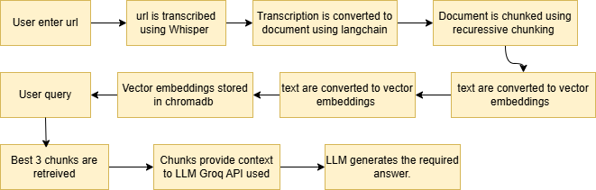

# A simple RAG- chatbot 
Input the link of youtube video you want to analyse and ask question ranging from summaries , to analysis of Why this video get so many likes?
# Installation
```
pip install requirements.txt
```
Replace GROQ_API_KEY with you actual groq api key.
```
streamlit run pull.py
```
# Description

